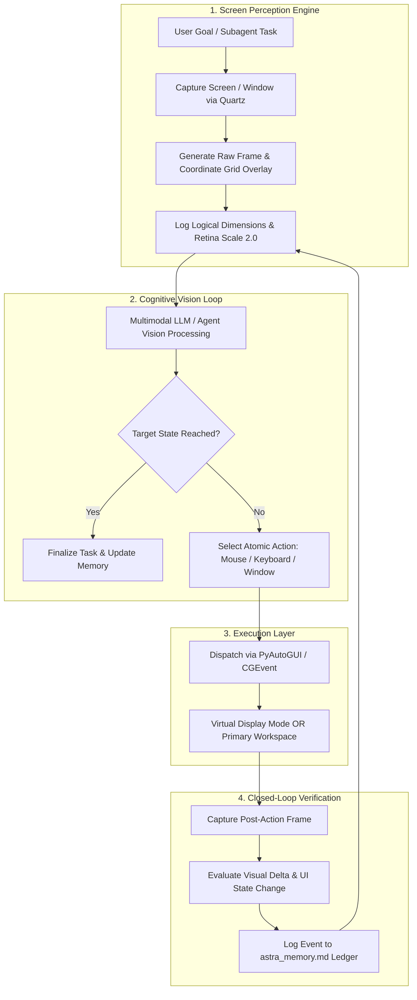

# 🌌 Astra Skill: Autonomous Continuous Screen Perception & Computer Control

[](LICENSE)
[](https://apple.com)
[](https://python.org)
[](https://github.com/markknoffler/Astra_skill)

**Astra Skill** is an enterprise-grade agentic skill inspired by **GPT-6 Astra** designed to grant AI models autonomous, continuous screen perception and precision OS-level computer control.

Unlike conventional macro bots that blindly fire coordinate clicks, Astra operates in a **continuous closed-loop perception-action-verification cycle**: the agent visually perceives the screen, overlays a sub-pixel logical coordinate grid, reasons about UI state changes, dispatches atomic mouse and keyboard strokes, visually verifies the outcome, and maintains persistent episodic memory across a rolling FIFO screenshot buffer.

---

## 📑 Table of Contents

- [Architectural Overview](#-architectural-overview)
- [The Perception-Action-Verification Pipeline](#-the-perception-action-verification-pipeline)
- [Core Pillars & Capabilities](#-core-pillars--capabilities)
  - [1. Model-Driven Screen Perception (`screen_capture.py`)](#1-model-driven-screen-perception-screen_capturepy)
  - [2. Atomic Precision Mouse Actions (`mouse_action.py`)](#2-atomic-precision-mouse-actions-mouse_actionpy)
  - [3. Dual-Mode Keyboard & Code Streamer (`keyboard_action.py`)](#3-dual-mode-keyboard--code-streamer-keyboard_actionpy)
  - [4. Native Virtual Display Controller (`virtual_display_manager.py`)](#4-native-virtual-display-controller-virtual_display_managerpy)
  - [5. Non-Activating Floating HUD Overlay (`floating_overlay.py`)](#5-non-activating-floating-hud-overlay-floating_overlaypy)
  - [6. Persistent Episodic Memory Ledger (`memory_manager.py`)](#6-persistent-episodic-memory-ledger-memory_managerpy)
- [Repository Structure](#-repository-structure)
- [Prerequisites & Installation](#-prerequisites--installation)
- [CLI Quickstart & Usage Guide](#-cli-quickstart--usage-guide)
- [Agent Integration (Antigravity, Claude, Custom LLMs)](#-agent-integration)
- [Privacy, Safety & Zero-Screenshot Git Discipline](#-privacy--zero-screenshot-discipline)

---

## 🏛️ Architectural Overview

Traditional computer use agents suffer from four catastrophic failure modes:
1. **Blind Execution**: Disagreeing with asynchronous UI lag, rendering delays, and modal popups.
2. **Focus Stealing & Disruption**: Jacking the user's active cursor and keyboard, making background work impossible.
3. **Memory Loss on FIFO Pruning**: Losing critical context when older screenshots are pruned to conserve disk space.
4. **Resolution Desynchronization**: Confusing physical Retina pixels ($2\times$) with macOS logical points ($1\times$).

Astra resolves all four by decoupling perception from foreground activation and anchoring every interaction to an audited episodic state machine:



---

## 🔄 The Perception-Action-Verification Pipeline

Every single interaction executed by Astra follows an unyielding 5-phase lifecycle:

1. **Active Perception Request**: The model inspects the screen by requesting a fresh frame. A subtle, non-intrusive coordinate grid labeled in logical screen points is overlaid onto the image.
2. **Sub-Pixel Coordinate Calibration**: Coordinates are strictly mapped to macOS logical points (`1470 x 923`) rather than physical hardware pixels (`2940 x 1846`), eliminating Retina misalignment.
3. **Atomic Action Execution**: The model triggers an atomic operation (`click`, `drag`, `keystroke`, `hold_key`, or `stream_code`).
4. **Post-Action Visual Delta Verification**: Immediately following input dispatch, a post-action screenshot is captured and inspected. The model checks:
   - Did the menu actually open?
   - Did the cursor focus the intended input field?
   - Did an unexpected modal or notification obstruct the workspace?
   - Did a build error or syntax error indicator appear?
5. **Episodic Memory Journaling**: The visual delta, coordinates, obstacles encountered, and recovery solutions are committed to `astra_memory.md` before the next action is planned.

---

## 🚀 Core Pillars & Capabilities

### 1. Model-Driven Screen Perception (`screen_capture.py`)

Takes on-demand screenshots whenever the agent decides to inspect the workspace:
- **Zero Focus Stealing App Targeting**: Captures background application windows (e.g. Blender, Xcode, Terminal) directly from macOS Quartz Window Server without bringing them to the foreground:
  ```bash
  python3 scripts/screen_capture.py --app Blender
  ```
- **Logical Coordinate Grid Overlay**: Generates `screenshots/latest.png` stamped with coordinate gridlines every 50 and 100 points, enabling pixel-accurate visual targeting.
- **50-Frame FIFO Rolling Buffer**: Stores timestamped frames in `screenshots/history/` while automatically pruning frames older than 50 to maintain a lean storage footprint.

### 2. Atomic Precision Mouse Actions (`mouse_action.py`)

Handles high-precision cursor manipulation with sub-pixel rounding:
- **Supported Actions**: `move`, `click`, `right_click`, `double_click`, `triple_click`, `drag`, `scroll`, `zoom`.
- **Micro-Easing Curves**: Implements smooth cursor trajectories and human-like click durations (50ms - 120ms) to ensure desktop OS listeners register all events.
- **Drag & Drop Coordinates**: Explicit `start_x, start_y` to `end_x, end_y` vectors with customizable mouse button mapping.

### 3. Dual-Mode Keyboard & Code Streamer (`keyboard_action.py`)

Designed specifically for complex GUI software (Blender, Unreal Engine, CAD, IDEs):
- **Mode 1: Precision Keystrokes & Chords**:
  ```bash
  python3 scripts/keyboard_action.py hotkey --keys cmd s
  ```
- **Mode 2: Persistent Hold & Release States**: Critical for 3D viewport navigation (e.g., orbiting, panning with `Shift + Middle Mouse`, or holding `Option` for camera pivots):
  ```bash
  python3 scripts/keyboard_action.py hold --key shift
  python3 scripts/keyboard_action.py release --key shift
  ```
- **Mode 3: High-Speed File-to-Cursor Code Streamer**: Reads entire script files and streams them into active text editors at realistic typing speeds (up to 800 WPM) with automatic bracket handling.

### 4. Native Virtual Display Controller (`virtual_display_manager.py`)

Enables true **Dual-Cursor / Offscreen Simulation** without third-party display hardware:
- Uses the native macOS `CGVirtualDisplay` Objective-C runtime to spawn an isolated `1920x1080 @ 60Hz` virtual screen.
- Moves target applications to the virtual display space using the macOS Accessibility API (`AXUIElementSetAttributeValue`).
- Allows the AI agent to click, type, and render on the virtual display while the user continues working unimpeded on their physical monitor.

### 5. Non-Activating Floating HUD Overlay (`floating_overlay.py`)

A translucent macOS Picture-in-Picture window allowing users to watch the AI work in real time:
- Implemented with `NSWindowStyleMaskNonactivatingPanel` and `NSFloatingWindowLevel`.
- Floats above all Mission Control spaces and full-screen apps.
- **100% Non-Activating**: Never steals focus, keyboard events, or active window status from the user.

### 6. Persistent Episodic Memory Ledger (`memory_manager.py`)

Prevents context amnesia when older screenshots are pruned:
- Automatically maintains `astra_memory.md` in the agent's working directory.
- Structures data across 4 audited sections:
  1. **Task Overview & Current Subgoal**
  2. **Critical Extracted Information & Entity Vault** (IDs, forms, text extracted from screens)
  3. **Navigation Obstacles & Recovery Log** (misclicks, popups, workarounds)
  4. **Chronological Screen Event Journal** (visual observations, actions taken, and outcomes)

---

## 📁 Repository Structure

```
Astra_skill/
├── SKILL.md                         # Antigravity agent system prompt & skill declaration
├── README.md                        # Complete technical manual & architectural guide
├── .gitignore                       # Strict exclusion rules for screenshots and cache
├── assets/
│   └── architecture_spec.md         # Component specifications and schemas
├── references/
│   ├── architecture.md              # End-to-end system control flow
│   ├── coordinate_system.md         # Logical vs Physical Retina coordinate calibration
│   ├── keyboard_control.md          # Keycodes, modifiers, hold/release protocols
│   ├── long_running_loop.md         # Autonomous loop persistence protocols
│   └── memory_ledger.md             # Episodic memory schema and audit trail specs
└── scripts/
    ├── screen_capture.py            # Screen perception & coordinate grid generator
    ├── mouse_action.py              # Atomic mouse controller
    ├── keyboard_action.py           # Keystroke, hold/release, and code streaming engine
    ├── virtual_display_manager.py   # Native macOS CGVirtualDisplay controller
    ├── floating_overlay.py          # Non-activating floating PiP HUD overlay
    ├── memory_manager.py            # Episodic memory ledger manager
    └── screen_daemon.py             # Autonomous event listener & loop daemon
```

---

## 🛠️ Prerequisites & Installation

### System Requirements
- **macOS**: 12.0 (Monterey), 13.0 (Ventura), 14.0 (Sonoma), 15.0+ (Sequoia).
- **Python**: 3.10, 3.11, or 3.12.
- **Permissions**: Terminal / Agent host application must be granted **Screen Recording** and **Accessibility** permissions under macOS `System Settings -> Privacy & Security`.

### Setup
Clone the repository and install core dependencies:
```bash
git clone https://github.com/markknoffler/Astra_skill.git
cd Astra_skill

# Create virtual environment (optional)
python3 -m venv .venv
source .venv/bin/activate

# Install dependencies
pip install pyautogui pillow pyobjc pyobjc-framework-Quartz pyobjc-framework-CoreGraphics
```

---

## 💻 CLI Quickstart & Usage Guide

### 1. Inspect the Screen
```bash
# Capture full primary display with coordinate grid
python3 scripts/screen_capture.py

# Target specific application in the background (zero focus stealing)
python3 scripts/screen_capture.py --app Blender
```

### 2. Dispatch Mouse Actions
```bash
# Single click at logical coordinates X: 450, Y: 220
python3 scripts/mouse_action.py click --x 450 --y 220

# Double click
python3 scripts/mouse_action.py double_click --x 120 --y 340

# Drag and drop
python3 scripts/mouse_action.py drag --start_x 200 --start_y 300 --end_x 600 --end_y 300 --duration 0.8

# Scroll down
python3 scripts/mouse_action.py scroll --x 500 --y 500 --clicks -5
```

### 3. Dispatch Keyboard Actions
```bash
# Type text directly
python3 scripts/keyboard_action.py type --text "bpy.ops.render.render()"

# Keyboard shortcut
python3 scripts/keyboard_action.py hotkey --keys cmd shift s

# Press and hold key (for 3D navigation / camera orbit)
python3 scripts/keyboard_action.py hold --key shift
# ... do mouse drag to pan ...
python3 scripts/keyboard_action.py release --key shift

# Stream code from file directly into cursor
python3 scripts/keyboard_action.py stream --file my_script.py --wpm 650
```

### 4. Launch Floating HUD
```bash
python3 scripts/floating_overlay.py --image screenshots/latest.png --width 420 --height 270
```

---

## 🤖 Agent Integration

### Loading into Google Antigravity / Gemini CLI
To equip Antigravity agents with the Astra Skill:
1. Place the `Astra_skill` directory into your project's `.agents/skills/` directory (or user global `~/.gemini/antigravity/skills/`).
2. Antigravity automatically parses `SKILL.md` frontmatter and equips the calling model with all perception, mouse, and keyboard tools.

### Activating in Custom LLM Pipelines (OpenAI, Anthropic, LangChain)
Point your agent's system prompt to `SKILL.md`. The model will utilize tool-calling schemas to invoke `python3 scripts/screen_capture.py` and inspect returned coordinate metadata before issuing commands.

---

## 🔒 Privacy & Zero-Screenshot Discipline

- **Strict `.gitignore` Policy**: Raw screen captures, user desktops, window dumps, and personal data are strictly excluded from git tracking (`screenshots/`, `*.png`, `*.jpg`).
- **Local-Only Processing**: Grid generation, Quartz captures, and mouse/keyboard events execute 100% locally on the device with zero cloud telemetry.
- **Sanitized Ledger**: The episodic memory manager records logical UI components, action summaries, and error recoveries while keeping sensitive user tokens out of long-term logs.

---

## 📄 License

This project is licensed under the [MIT License](LICENSE).
